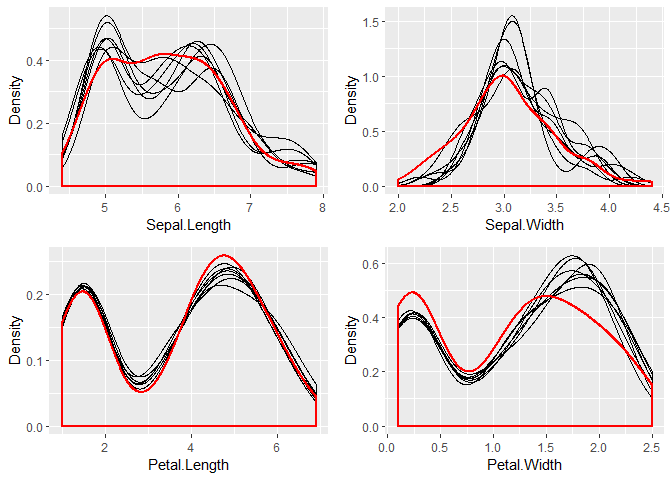
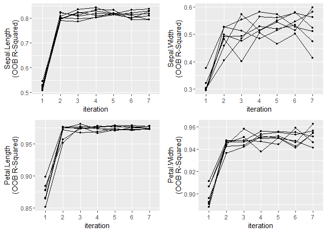
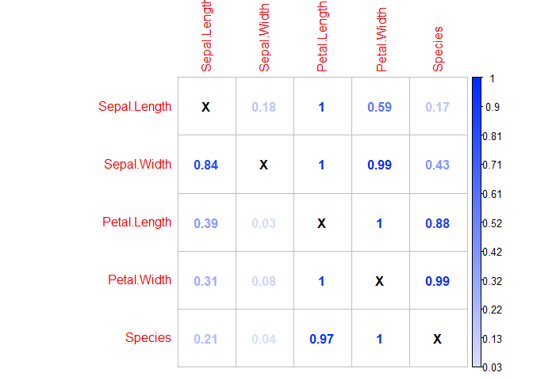
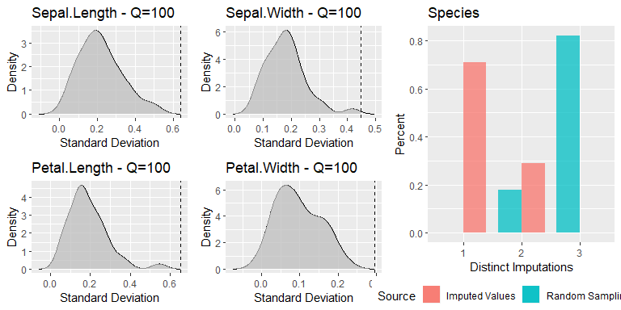
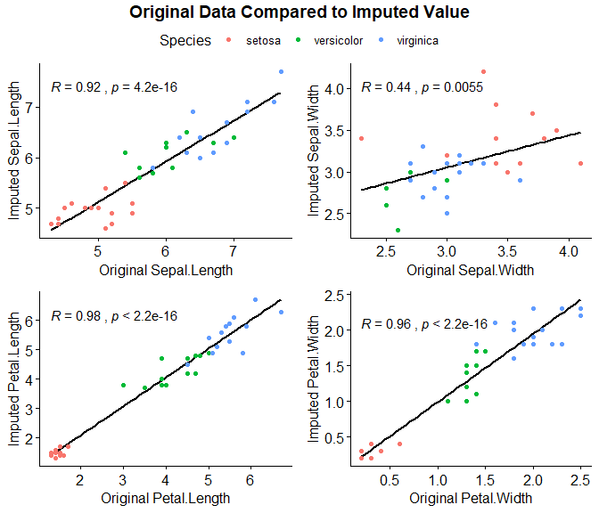
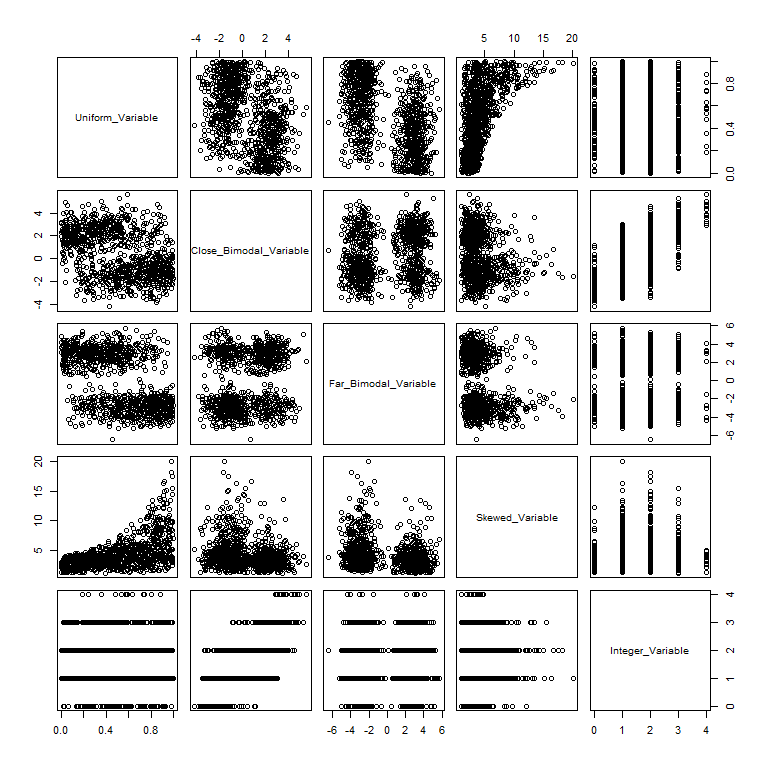

[](http://opensource.org/licenses/MIT)
[](http://cran.r-project.org/package=miceRanger)
[](https://travis-ci.com/FarrellDay/miceRanger)
[](https://codecov.io/gh/FarrellDay/miceRanger/branch/master)

## miceRanger: Fast Imputation with Random Forests

<a href='https://github.com/FarrellDay/miceRanger'></a>

Fast, memory efficient Multiple Imputation by Chained Equations (MICE)
with random forests. It can impute categorical and numeric data without
much setup, and has an array of diagnostic plots available.

This document contains a thorough walkthrough of the package,
benchmarks, and an introduction to multiple imputation. More information
on MICE can be found in Stef van Buuren’s excellent online book, which
you can find
[here](https://stefvanbuuren.name/fimd/ch-introduction.html).

#### Table of Contents:

  - [Using
    miceRanger](https://github.com/FarrellDay/miceRanger#Using-miceRanger)
      - [Simple
        Example](https://github.com/FarrellDay/miceRanger#Simple-Example)
      - [Running in
        Parallel](https://github.com/FarrellDay/miceRanger#Running-in-Parallel)
      - [Adding
        Iterations/Datasets](https://github.com/FarrellDay/miceRanger#adding-more-iterationsdatasets)
      - [Specifying Methods by
        Variable](https://github.com/FarrellDay/miceRanger#Specifying-Predictors-and-Value-Selector-by-Variable)
  - [Diagnostic
    Plotting](https://github.com/FarrellDay/miceRanger#Diagnostic-Plotting)
      - [Imputed
        Distributions](https://github.com/FarrellDay/miceRanger#Distribution-of-Imputed-Values)
      - [Correlation
        Convergence](https://github.com/FarrellDay/miceRanger#Convergence-of-Correlation)
      - [Center/Dispersion
        Convergence](https://github.com/FarrellDay/miceRanger#Center-and-Dispersion-Convergence)
      - [Model OOB
        Error](https://github.com/FarrellDay/miceRanger#Model-OOB-Error)
      - [Variable
        Importance](https://github.com/FarrellDay/miceRanger#Variable-Importance)
      - [Inter-Dataset
        Variance](https://github.com/FarrellDay/miceRanger#Imputed-Variance-Between-Datasets)
  - [Using the Imputed
    Data](https://github.com/FarrellDay/miceRanger#Using-the-Imputed-Data)  
  - [Benchmarks](https://github.com/FarrellDay/miceRanger#Benchmarks)  
  - [The MICE
    Algorithm](https://github.com/FarrellDay/miceRanger#The-MICE-Algorithm)
      - [Introduction](https://github.com/FarrellDay/miceRanger#The-MICE-Algorithm)
      - [Common Use
        Cases](https://github.com/FarrellDay/miceRanger#Common-Use-Cases)
      - [Predictive Mean
        Matching](https://github.com/FarrellDay/miceRanger#Predictive-Mean-Matching)

## Installation

You can download the latest stable version from CRAN:

``` r
install.packages("miceRanger")
```

You can also download the latest development version from this
repository:

``` r
library(devtools)
devtools::install_github("FarrellDay/miceRanger")
```

For more information about updates, please see
[NEWS.md](https://github.com/FarrellDay/miceRanger/blob/master/NEWS.md).

## Using miceRanger

In these examples we will be looking at a simple example of multiple
imputation. We need to load the packages, and define the data:

``` r
require(miceRanger)
set.seed(1)

# Load data
data(iris)

# Ampute the data. iris contains no missing values by default.
ampIris <- amputeData(iris,perc=0.25)
head(ampIris,10)
```

    ##     Sepal.Length Sepal.Width Petal.Length Petal.Width Species
    ##  1:          5.1         3.5           NA         0.2    <NA>
    ##  2:          4.9         3.0          1.4         0.2  setosa
    ##  3:          4.7         3.2          1.3         0.2  setosa
    ##  4:          4.6         3.1          1.5         0.2  setosa
    ##  5:          5.0         3.6          1.4         0.2  setosa
    ##  6:          5.4         3.9          1.7         0.4  setosa
    ##  7:           NA         3.4          1.4         0.3  setosa
    ##  8:          5.0         3.4          1.5         0.2  setosa
    ##  9:          4.4         2.9          1.4         0.2    <NA>
    ## 10:          4.9         3.1          1.5         0.1  setosa

### Simple example

``` r
# Perform mice, return 6 datasets. 
seqTime <- system.time(
  miceObj <- miceRanger(
      ampIris
    , m=6
    , verbose=FALSE
  )
)
miceObj
```

    ## 
    ## Class:          miceDefs
    ## Datasets:       6 
    ## Iterations:     5 
    ## Total Seconds:  4 
    ## Imputed Cols:   5 
    ## Estimated Time per Additional Iteration is 5 Seconds 
    ## Estimated Time per Additional Dataset is 3 Seconds 
    ## 
    ## For additional metrics, see the different plotting functions.

Printing the miceDefs object will tell you some high level information,
including how long the process took, and how long it estimates adding
more datasets/iterations will take.

### Running in Parallel

Running in parallel is usually not necessary. By default, `ranger` will
use all available cores, and `data.table`s assignment by reference is
already lightning fast. However, in certain cases, we can still save
some time by sending each dataset imputation to a different R back end.
To do this, we need to set up a core cluster and use `parallel = TRUE`.
*This causes the dataset to be copied for each back end, which may eat
up your RAM. If the process is memory constrained, this can cause the
parallel implementation to actually take more time than the sequential
implementation.*

``` r
library(doParallel)

# Set up back ends.
cl <- makeCluster(2)
registerDoParallel(cl)

# Perform mice 
parTime <- system.time(
  miceObjPar <- miceRanger(
      ampIris
    , m=6
    , parallel = TRUE
    , verbose = FALSE
  )
)
stopCluster(cl)
registerDoSEQ()
```

Let’s take a look at the time we saved running in parallel:

``` r
perc <- round(1-parTime[[3]]/seqTime[[3]],2)*100
print(paste0("The parallel process ran ",perc,"% faster using 2 R back ends."))
```

    ## [1] "The parallel process ran 12% faster using 2 R back ends."

We did not save that much time by running in parallel. `ranger` already
makes full use of our CPU. Running in parallel will save you time if you
are using a high `meanMatchCandidates`, or if you are working with large
data and use a low . See
[`benchmarks/`](https://github.com/FarrellDay/miceRanger/tree/master/benchmarks)
for more details.

### Adding More Iterations/Datasets

If you plot your data and notice that you need to may need to run more
iterations, or you would like more datasets for your analysis, you can
use the following functions:

``` r
miceObj <- addIterations(miceObj,iters=2,verbose=FALSE)
miceObj <- addDatasets(miceObj,datasets=1,verbose=FALSE)
```

### Specifying Predictors and Value Selector by Variable

It is possible to customize our imputation procedure by variable. By
passing a named list to `vars`, you can specify the predictors for each
variable to impute. You can also select which variables should be
imputed using mean matching by passing a named vector to
`valueSelector`.

``` r
v <- list(
  Sepal.Width = c("Sepal.Length","Petal.Width","Species")
  , Sepal.Length = c("Sepal.Width","Petal.Width")
  , Species = c("Sepal.Width")
)
pmm <- c(
    Sepal.Width = "meanMatch"
  , Sepal.Length = "value"
  , Species = "meanMatch"
)

miceObjCustom <- miceRanger(
    ampIris
  , vars = v
  , valueSelector = pmm
  , verbose=FALSE
)
```

## Diagnostic Plotting

`miceRanger` comes with an array of diagnostic plots that tell you how
valid the imputations may be, how they are distributed, which variables
were used to impute other variables, and so on.

### Distribution of Imputed Values

We can take a look at the imputed distributions compared to the original
distribution for each variable:

``` r
plotDistributions(miceObj,vars='allNumeric')
```

<!-- -->

The red line is the density of the original, nonmissing data. The
smaller, black lines are the density of the imputed values in each of
the datasets. If these don’t match up, it’s not a problem, however it
may tell you that your data was not Missing Completely at Random (MCAR).

### Convergence of Correlation

We are probably interested in knowing how our values between datasets
converged over the iterations. The `plotCorrelations` function shows you
a boxplot of the correlations between imputed values in every
combination of datasets, at each iteration:

``` r
plotCorrelations(miceObj,vars='allNumeric')
```

<!-- -->

Different correlation measures can be plotted by specifying
`factCorrMetric` and `numbCorrMetric`. See `?plotCorrelations` for more
details.

### Center and Dispersion Convergence

Sometimes, if the missing data locations are correlated with higher or
lower values, we need to run multiple iterations for the process to
converge to the true theoretical mean (given the information that exists
in the dataset). We can see if the imputed data converged, or if we need
to run more iterations:

``` r
plotVarConvergence(miceObj,vars='allNumeric')
```

<!-- -->

It doesn’t look like this dataset had a convergence issue. We wouldn’t
expect one, since we amputed the data above completely at random for
each variable. When plotting categorical variables, the center and
dispersion metrics plotted are the percent of the mode and the entropy,
respectively.

### Model OOB Error

Random Forests give us a cheap way to determine model error without
cross validation. Each model returns the OOB accuracy for
classification, and r-squared for regression. We can see how these
converged as the iterations progress:

``` r
plotModelError(miceObj,vars='allNumeric')
```

<!-- -->

It looks like the variables were imputed with a reasonable degree of
accuracy. That spike after the first iteration was due to the nature of
how the missing values are filled in before the models are run.

### Variable Importance

Now let’s plot the variable importance for each imputed variable. The
top axis contains the variable that was used to impute the variable on
the left axis.

``` r
plotVarImportance(miceObj)
```

<!-- -->

The variable importance metric used is returned by ranger when
`importance = 'impurity'`. Due to large possible variances in the
returned value, the data plotted here has been 0-1 scaled within each
imputed variable. Use `display = 'Absolute'` to show unscaled variable
importance.

### Imputed Variance Between Datasets

We are probably interested in how “certain” we were of our imputations.
We can get a feel for the variance experienced for each imputed value
between the datasets by using `plotImputationVariance()` function:

``` r
plotImputationVariance(miceObj,ncol=2,widths=c(5,3))
```

<!-- -->

When plotting categorical data, the distribution of the number of unique
imputed levels is compared to the theoretical distribution of unique
levels, given they were drawn randomly. You can see that most of the
imputed values only had 1 imputed value across our 8 datasets, which
means that the imputation process was fairly ‘certain’ of that imputed
class. According to the graph, most of our samples would have had 3
different samples drawn, if they were drawn randomly for each dataset
sample.  
When plotting the variance of numeric features, the standard deviation
of the imputed values is calculated for each sample. This is then
compared to the total population standard deviation. Percentage of the
samples with a SD below the population SD is shaded in the densities
above, and the Quantile is shown in the title. The `iris` dataset tends
to be full of correlation, so all of our imputations had a SD lower than
the population SD, however this will not always be the case.

## Using the Imputed Data

To return the imputed data simply use the `completeData` function:

``` r
dataList <- completeData(miceObj)
head(dataList[[1]],10)
```

    ##     Sepal.Length Sepal.Width Petal.Length Petal.Width Species
    ##  1:          5.1         3.5          1.3         0.2  setosa
    ##  2:          4.9         3.0          1.4         0.2  setosa
    ##  3:          4.7         3.2          1.3         0.2  setosa
    ##  4:          4.6         3.1          1.5         0.2  setosa
    ##  5:          5.0         3.6          1.4         0.2  setosa
    ##  6:          5.4         3.9          1.7         0.4  setosa
    ##  7:          5.1         3.4          1.4         0.3  setosa
    ##  8:          5.0         3.4          1.5         0.2  setosa
    ##  9:          4.4         2.9          1.4         0.2  setosa
    ## 10:          4.9         3.1          1.5         0.1  setosa

We can see how the imputed data compares to the original data before it
was amputed:

<!-- -->

It looks like most of our variables were imputed with a high degree of
accuracy. Sepal.Width had a relatively poor Spearman correlation,
however we expected this when we saw the results from `plotModelError()`
above.

## Benchmarks

Scripts and more details on benchmarks can be found in
[`benchmarks/`](https://github.com/FarrellDay/miceRanger/tree/master/benchmarks).

Using artificial data, the time and performance of miceRanger, mice
(`method = "rf"`) and missForest were recorded. parlmice was used to run
`mice` in parallel, and a parallel back end was set up for missForest.
All runs used 5 cores. miceRangerPar refers to miceRanger being run with
`parallel = TRUE`.

### Timing - Small and Medium Data


## The MICE Algorithm

Multiple Imputation by Chained Equations ‘fills in’ (imputes) missing
data in a dataset through an iterative series of predictive models. In
each iteration, each specified variable in the dataset is imputed using
the other variables in the dataset. These iterations should be run until
it appears that convergence has been met.


This process is continued until all specified variables have been
imputed. Additional iterations can be run if it appears that the average
imputed values have not converged, although no more than 5 iterations
are usually necessary.

### Common Use Cases

##### **Data Leakage:**

MICE is particularly useful if missing values are associated with the
target variable in a way that introduces leakage. For instance, let’s
say you wanted to model customer retention at the time of sign up. A
certain variable is collected at sign up or 1 month after sign up. The
absence of that variable is a data leak, since it tells you that the
customer did not retain for 1 month.

##### **Funnel Analysis:**

Information is often collected at different stages of a ‘funnel’. MICE
can be used to make educated guesses about the characteristics of
entities at different points in a funnel.

##### **Confidence Intervals:**

MICE can be used to impute missing values, however it is important to
keep in mind that these imputed values are a prediction. Creating
multiple datasets with different imputed values allows you to do two
types of inference:

  - Imputed Value Distribution: A profile can be built for each imputed
    value, allowing you to make statements about the likely distribution
    of that value.  
  - Model Prediction Distribution: With multiple datasets, you can build
    multiple models and create a distribution of predictions for each
    sample. Those samples with imputed values which were not able to be
    imputed with much confidence would have a larger variance in their
    predictions.

### Predictive Mean Matching

`miceRanger` can make use of a procedure called predictive mean matching
(PMM) to select which values are imputed. PMM involves selecting a
datapoint from the original, nonmissing data which has a predicted value
close to the predicted value of the missing sample. The closest N
(`meanMatchCandidates` parameter in `miceRanger()`) values are chosen as
candidates, from which a value is chosen at random. Going into more
detail from our example above, we see how this works in practice:


This method is very useful if you have a variable which needs imputing
which has any of the following characteristics:

  - Multimodal  
  - Integer  
  - Skewed

### Effects of Mean Matching

As an example, let’s construct a dataset with some of the above
characteristics:

``` r
# random uniform variable
nrws <- 1000
dat <- data.table(Uniform_Variable = runif(nrws))

# slightly bimodal variable correlated with Uniform_Variable
dat$Close_Bimodal_Variable <- sapply(
    dat$Uniform_Variable
  , function(x) sample(c(rnorm(1,-2),rnorm(1,2)),prob=c(x,1-x),size=1)
) + dat$Uniform_Variable

# very bimodal variable correlated with Uniform_Variable
dat$Far_Bimodal_Variable <- sapply(
    dat$Uniform_Variable
  , function(x) sample(c(rnorm(1,-3),rnorm(1,3)),prob=c(x,1-x),size=1)
)

# Highly skewed variable correlated with Uniform_Variable
dat$Skewed_Variable <- exp((dat$Uniform_Variable*runif(nrws)*3)) + runif(nrws)*3

# Integer variable correlated with Close_Bimodal_Variable and Uniform_Variable
dat$Integer_Variable <- round(dat$Uniform_Variable + dat$Close_Bimodal_Variable/3 + runif(nrws)*2)

# Ampute the data.
ampDat <- amputeData(dat,0.2)

# Plot the original data
plot(dat)
```

<!-- -->

We can see how our variables are distributed and correlated in the graph
above. Now let’s run our imputation process twice, once using mean
matching, and once using the model prediction.

``` r
mrMeanMatch <- miceRanger(ampDat,valueSelector = "meanMatch",verbose=FALSE)
mrModelOutput <- miceRanger(ampDat,valueSelector = "value",verbose=FALSE)
```

Let’s look at the effect on the different variables.

#### Bimodial Variable


The affect of mean matching on our imputations is immediately apparent.
If we were only looking at model error, we may be inclined to use the
Prediction Value, since it has a higher OOB R-Squared. However, we are
left with imputations that do not match our original distribution, and
therefore, do not behave like our original data.

#### Skewed Variable


We see a similar occurance in the skewed variable - the distribution of
the values imputed with the Prediction Value are shifted towards the
mean.

#### Integer Variable


The most obvious variable affected by mean matching was our integer
variable - using `valueSelector = 'value'` allows interpolation in the
numeric variables. Using mean matching has allowed us to keep the
distribution and distinct values of the original data, without
sacrificing accuracy.
