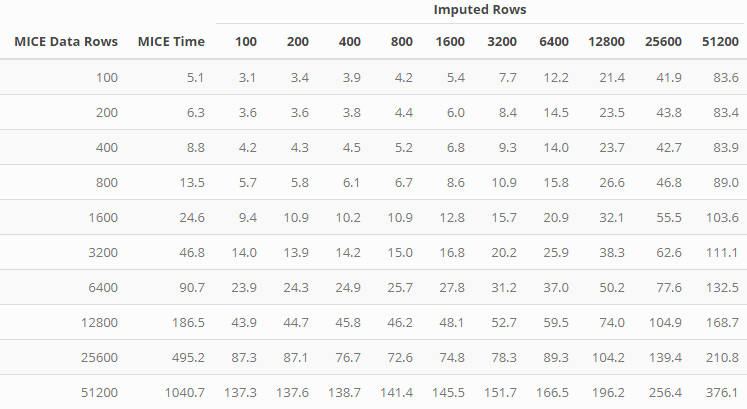

## Benchmarking miceRanger

All scripts to create the following charts can be found in scripts/.

Using artificial data, the time and performance of miceRanger, mice
(`method = "rf"`) and missForest were recorded. parlmice was used to run
`mice` in parallel, and a parallel back end was set up for missForest.
All runs used 5 cores. miceRangerPar refers to miceRanger being run with
`parallel = TRUE`.

### Timing - Small and Medium Data

Scripts used:

  - mediumData.R  
  - smallData.R

### Timing - Rows x Trees

Data used was 10 columns, 7 numeric and 3 factors. Time recorded is in
seconds.  

Script used:

  - rowXtrees.R

### Performance - Imputing New Data

Existing models can be recycled to impute new datasets with the `impute`
function. This ends up being much faster, and (nearly) just as accurate
as re-running MICE. Three charts are shown below - the first shows the
accuracy of imputing data with existing models vs. re-running MICE. The
second shows the performance achieved on the `iris` dataset for
different data missingness levels, and the third shows the speed
advantages of imputing new data with existing models vs re-running MICE.

#### Accuracy of Imputations from Existing Models vs New Models

In the following chart, a dataset with 15 variables (a-j numeric, k-p
categorical) and 51200 rows was imputed using `miceRanger`. A different
dataset with the same dimensions, but different data, was then imputed
using the models created with `miceRanger`.

Performance is nearly the same between the two. However, as noted below,
the `impute` function takes much less time.

Script used:

  - imputeNew\_Time.R

#### Accuracy for different Missingness of data:

<!-- -->

This chart was created to show the behavior of imputation performance
when new data is imputed with different levels of missingness.  
The chart above consisted of the following procedure:

1)  A miceDefs object is created with 50 imputed datasets on a dataset
    with 25% missing values.  
2)  All 50 datasets are used to impute 9 new datasets, each with
    different levels of missingness  
3)  The performance (R-squared for numerics, accuracy for categoricals)
    is recorded for all 450 datasets

Script used:

  - imputeNew.R

#### Time to Completion of `miceRanger` vs `impute`

<!-- -->

Using the `impute` function is always faster than running MICE on the
same dataset. However, in most use cases, the dataset used to create a
`miceDefs` object will be larger than the running that will be imputed
with the `impute` function. There is overhead associated with calling
the predict S3 method in ranger related to [this
issue](https://github.com/imbs-hl/ranger/issues/133).

### To Do

Imputation accuracy benchmarking with MAR, MCAR, MNAR, skewed,
multimodal data.
